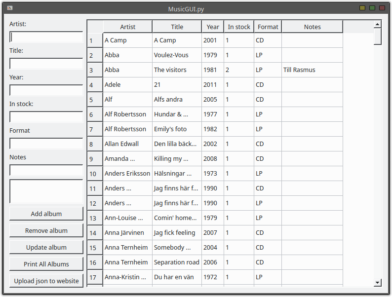
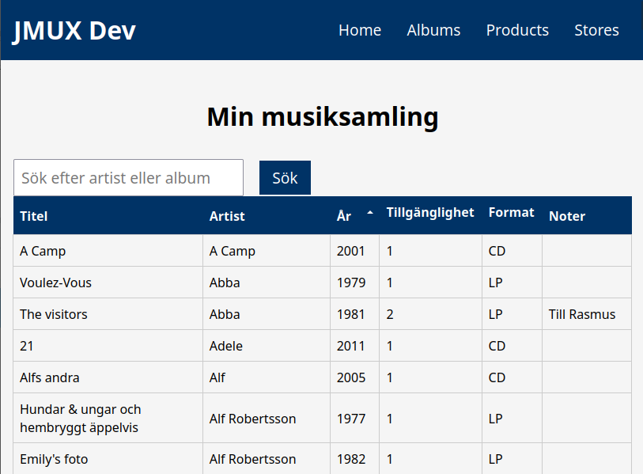

# Album Manager GUI

This is a graphical user interface (GUI) application for managing a list of music albums. The user can add, remove, and update albums, and view the list of all albums. The application is built using PyQt5 and stores the list of albums in a file called 'albums.json'.

FTP upload feature enables to push albums.json to a webserver. Index.html & javascript to load json data to website also uploaded.

Fun fact: Started as a try-out for coding with chatGPT-3 but grew bigger.



Figure 1 - Run MusicGUI.py graphical user interface to manipulate JSON



Figure 2 - Web server loading albums.json


Figure 3 - Transmit albums.json over FTP by GUI button "Upload json to website"

## Change log
### 2023-01-13
 - Added website files, albums in albums.json file are loaded to html with javascript
 - Added FTP upload feature from button in the GUI
 - Minimum table width reduced in GUI
### 2023-01-15

 - Added PKGBUILD AUR installer

## Prerequisites

- Python 3.10 or above
- PyQt5
- json

## Installation method 1 - Run Python from source

1. Clone the repository

```bash
git clone https://github.com/joeraven0/album-manager-gui.git
```
2. Install the dependencies

```bash
pip install pyqt5 json
```
3. Setup FTP cridentials in cridentials.txt (optional for publishing online)

  * cridentials.txt

4. Upload to web server (optional for publishing online)

  * index.html
  * styles.css
  * albums.js
  * albums.json (or upload through gui)

5. Run the script

```bash
python MusicGUI.py
```

## Installation method 2 - Install from Arch AUR package

1. Clone the repository

```bash
git clone https://github.com/joeraven0/album-manager-gui.git
```

2. Install the dependencies

```bash
pip install pyqt5 json
```

3. Build the package

```bash
makepkg
```
4. Install

```bash
pacman -U album-manager-gui-X.X-X-any.pkg.tar.zst
```
5. Set your FTP-cridentials (optional)

```bash
nano /usr/lib/album-manager-gui/cridentials.txt
```
## Usage

1. Enter the artist, title, year, and number of copies in stock for the album you want to add.
2. Click the "Add album" button to add the album to the list.
3. To remove an album, select the album in the table and click the "Remove album" button.
4. To update an album, select the album in the table, make the necessary changes in the input fields, and click the "Update album" button.
5. To view the list of all albums, click the "Print All Albums" button.
6. Upload through FTP, click the "Upload json to website" button. (optional)

## License

Free for everyone, always. Microsoft have to pay.
